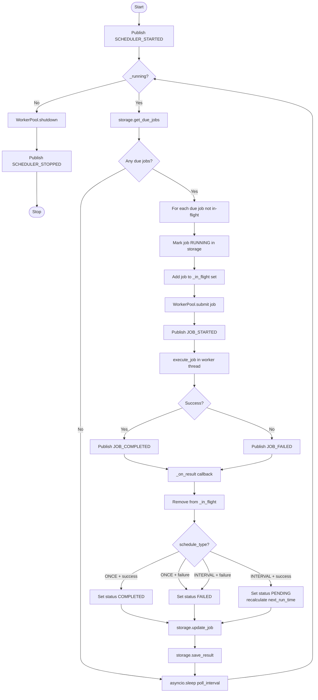
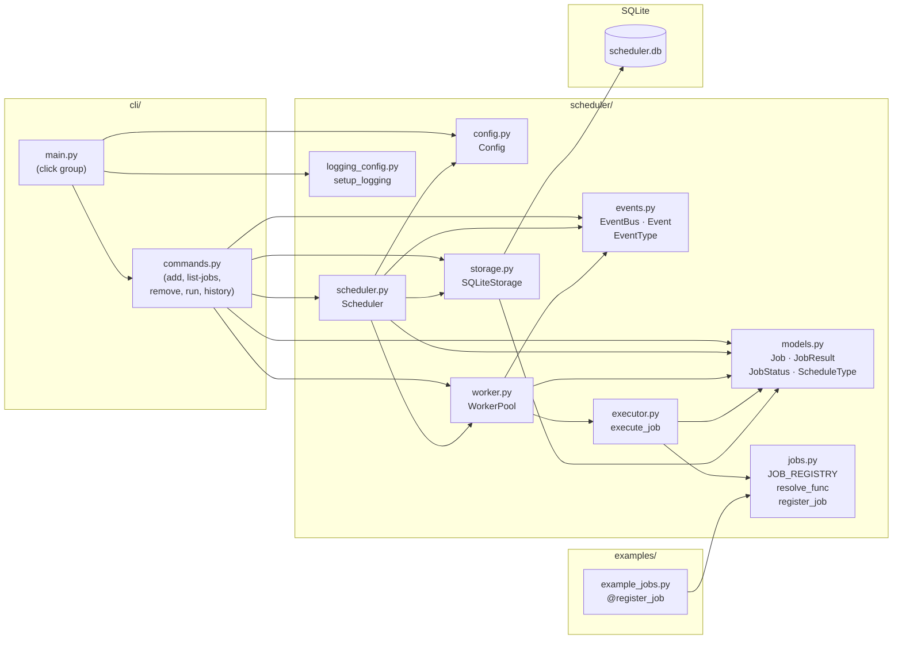
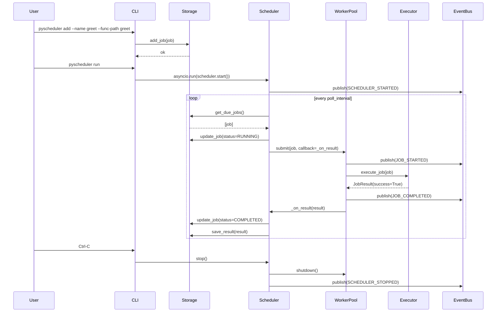

# Scheduler Diagrams

## 1. Scheduler Loop Flowchart

```mermaid
flowchart TD
    A([Start]) --> B[Publish SCHEDULER_STARTED]
    B --> C{_running?}
    C -- No --> Z[WorkerPool.shutdown]
    Z --> Y[Publish SCHEDULER_STOPPED]
    Y --> END([Stop])
    C -- Yes --> D[storage.get_due_jobs]
    D --> E{Any due jobs?}
    E -- No --> F[asyncio.sleep poll_interval]
    F --> C
    E -- Yes --> G[For each due job not in-flight]
    G --> H[Mark job RUNNING in storage]
    H --> I[Add job to _in_flight set]
    I --> J[WorkerPool.submit job]
    J --> K[Publish JOB_STARTED]
    K --> L[execute_job in worker thread]
    L --> M{Success?}
    M -- Yes --> N[Publish JOB_COMPLETED]
    M -- No --> O[Publish JOB_FAILED]
    N --> P[_on_result callback]
    O --> P
    P --> Q[Remove from _in_flight]
    Q --> R{schedule_type?}
    R -- ONCE + success --> S[Set status COMPLETED]
    R -- ONCE + failure --> T[Set status FAILED]
    R -- INTERVAL + success --> U[Set status PENDING\nrecalculate next_run_time]
    R -- INTERVAL + failure --> T
    S --> V[storage.update_job]
    T --> V
    U --> V
    V --> W[storage.save_result]
    W --> F
```

---

## 2. Component Diagram

```mermaid
graph LR
    subgraph CLI ["cli/"]
        MAIN["main.py\n(click group)"]
        CMDS["commands.py\n(add, list-jobs,\nremove, run, history)"]
        MAIN --> CMDS
    end

    subgraph SCHED ["scheduler/"]
        CFG["config.py\nConfig"]
        MODELS["models.py\nJob · JobResult\nJobStatus · ScheduleType"]
        STORE["storage.py\nSQLiteStorage"]
        EVENTS["events.py\nEventBus · Event\nEventType"]
        JOBS["jobs.py\nJOB_REGISTRY\nresolve_func\nregister_job"]
        EXEC["executor.py\nexecute_job"]
        WORKER["worker.py\nWorkerPool"]
        CORE["scheduler.py\nScheduler"]
        LOG["logging_config.py\nsetup_logging"]
    end

    subgraph EX ["examples/"]
        EXJOBS["example_jobs.py\n@register_job"]
    end

    subgraph DB ["SQLite"]
        SQLITEDB[("scheduler.db")]
    end

    MAIN --> CFG
    MAIN --> LOG
    CMDS --> STORE
    CMDS --> MODELS
    CMDS --> CORE
    CMDS --> WORKER
    CMDS --> EVENTS

    CORE --> CFG
    CORE --> STORE
    CORE --> WORKER
    CORE --> EVENTS
    CORE --> MODELS

    WORKER --> EXEC
    WORKER --> EVENTS
    WORKER --> MODELS

    EXEC --> JOBS
    EXEC --> MODELS

    STORE --> MODELS
    STORE --> SQLITEDB

    EXJOBS --> JOBS
```

---

## 3. Sequence Diagram: Scheduling and Executing a Job

```mermaid
sequenceDiagram
    participant User
    participant CLI
    participant Storage
    participant Scheduler
    participant WorkerPool
    participant Executor
    participant EventBus

    User->>CLI: pyscheduler add --name greet --func-path greet
    CLI->>Storage: add_job(job)
    Storage-->>CLI: ok

    User->>CLI: pyscheduler run
    CLI->>Scheduler: asyncio.run(scheduler.start())
    Scheduler->>EventBus: publish(SCHEDULER_STARTED)

    loop every poll_interval
        Scheduler->>Storage: get_due_jobs()
        Storage-->>Scheduler: [job]
        Scheduler->>Storage: update_job(status=RUNNING)
        Scheduler->>WorkerPool: submit(job, callback=_on_result)
        WorkerPool->>EventBus: publish(JOB_STARTED)
        WorkerPool->>Executor: execute_job(job)
        Executor-->>WorkerPool: JobResult(success=True)
        WorkerPool->>EventBus: publish(JOB_COMPLETED)
        WorkerPool->>Scheduler: _on_result(result)
        Scheduler->>Storage: update_job(status=COMPLETED)
        Scheduler->>Storage: save_result(result)
    end

    User->>CLI: Ctrl-C
    CLI->>Scheduler: stop()
    Scheduler->>WorkerPool: shutdown()
    Scheduler->>EventBus: publish(SCHEDULER_STOPPED)
```
